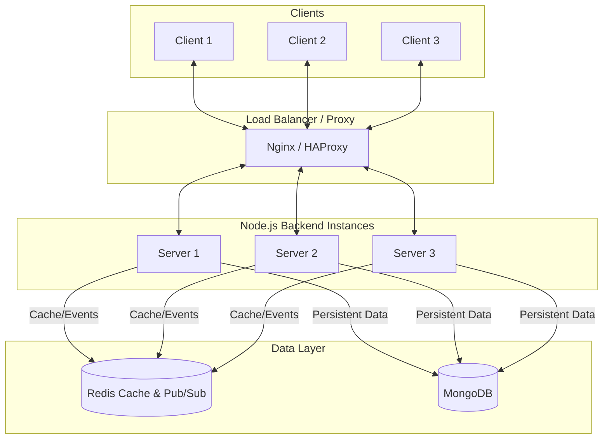

# Coaching Feed Application

A highly scalable, full-stack real-time coaching feed application built with Node.js, Express, Next.js, MongoDB, Redis, and Socket.IO.

## Prerequisites

Before running the application, make sure you have the following installed:
- Node.js (v18+)
- MongoDB (running locally on port 27017 or use a cloud URI)
- Redis (running locally on port 6379)

---

## Architecture Diagram (Scalability Prepared)



---

## 1. Backend Setup

### Installation Commands
Navigate to the backend directory and install dependencies:
```bash
cd backend
npm install
```

### Package Dependencies
The backend uses the following key packages:
- `express`: Web framework for Node.js
- `mongoose`: MongoDB object modeling
- `redis`: Redis client for caching and pub/sub adapter
- `socket.io` & `@socket.io/redis-adapter`: Real-time bidirectional event-based communication across multiple servers
- `cors`, `helmet`, `express-rate-limit`: Security middlewares
- `compression`: Payload optimization
- `express-validator`: Input validation
- `winston`: Comprehensive request and error logging
- `dotenv`: Environment variable management

### Environment Variables (.env)
Create a `.env` file in the `backend` directory. Here is an example (already provided as `.env.example`):
```env
PORT=5000
MONGO_URI=mongodb://127.0.0.1:27017/coaching_feed
REDIS_URL=redis://127.0.0.1:6379
FRONTEND_URL=http://localhost:3000
```

### Run Instructions
Start the backend server in development mode:
```bash
npm run dev
```

---

## 2. Frontend Setup

### Installation Commands
Navigate to the frontend directory and install dependencies:
```bash
cd frontend
npm install
```

### Package Dependencies
The frontend uses Next.js with the following key packages:
- `axios`: HTTP client for APIs
- `socket.io-client`: Client-side real-time communication
- `react-hot-toast`: Toast notifications for reconnect states and errors
- `lucide-react`: SVG icons
- `date-fns`: Timestamp formatting
- `tailwindcss`: Styling and UI design

### Environment Variables (.env.local)
Create a `.env.local` file in the `frontend` directory. Here is an example:
```env
NEXT_PUBLIC_API_URL=http://localhost:5000/api
NEXT_PUBLIC_SOCKET_URL=http://localhost:5000
```

### Run Instructions
Start the Next.js development server:
```bash
npm run dev
```

---

## Scalability & Bonus Features Implemented

### Bonus Features
1. **Socket Reconnect Handling**: Handled edge cases where connections drop. UI elegantly displays "Connected (green)", "Reconnecting (yellow)", and "Disconnected (red)" statuses with corresponding toast notifications.
2. **Duplicate Socket Prevention**: Frontend actively checks for duplicate `feed._id` inside `useFeeds` to prevent duplicate elements on initial load + socket events racing.
3. **Loading & Error Handling**: Loading spinners on the frontend, empty state graphics, and a functional "Retry" button. Forms have disabled states during API calls.
4. **Strict Input Validation**: Leveraged `express-validator` to ensure Titles (3-100 chars) and Messages (5-500 chars) are completely validated prior to reaching MongoDB. The frontend also implements client-side validation for instant feedback.

### Scalability Improvements
1. **API Pagination**: Feed API uses `?page=1&limit=10` query logic. Provides meta-data like `totalPages` and `totalItems`.
2. **MongoDB Indexing**: `feedSchema.index({ createdAt: -1 })` and `feedSchema.index({ title: 1 })` ensure lighting fast queries for sorting large data sets.
3. **Redis Caching Strategy**: Feed endpoints are cached using unique keys `feed:page:1:limit:10` with an expiration limit of 60 seconds (`EX: 60`). On feed creation, matching pagination keys are invalidated.
4. **Socket Scalability**: Attached `@socket.io/redis-adapter` with a Pub/Sub client configuration. This makes it instantly compatible with multi-instance Node setups (Load Balancing) as events propagate across servers.
5. **Winston Logging**: All API traffic, validation issues, errors, and redis connect/disconnects are comprehensively logged into `logs/error.log` and `logs/combined.log`.
6. **Security Upgrades**: Configured `helmet` for HTTP headers and `express-rate-limit` allowing exactly 100 requests per 15 minutes to prevent DDoS or spam feeds.
7. **Performance Tuning**: Applied `compression` middleware on backend payloads. Backed queries are now executed via `.lean()` for faster parsing, and frontend components like `FeedCard` are wrapped in `React.memo` to prevent unnecessary re-renders.

---